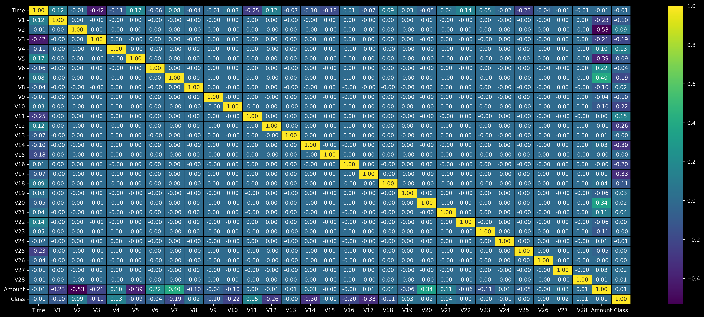
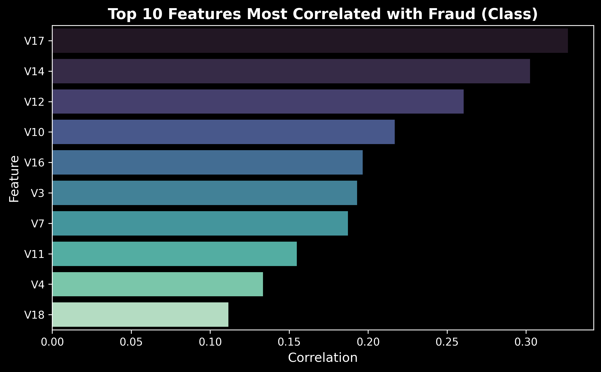

# Credit Card Fraud Detector

This project focuses on detecting fraudulent transactions using supervised machine learning models. It evaluates multiple algorithms and visualizes key patterns in the data, highlighting features most correlated with fraud. The final model is exported for future use or deployment.

---

## Repository Structure

```

ML-Projects/
└── creditcard-fraud-detector/
├── data/
│   └── README.md             # Explains how to get the dataset
├── model/
│   └── xgboost_fraud_model.pkl   # Saved XGBoost model
├── plots/
│   ├── correlation_heatmap.png       # Heatmap of feature correlations
│   └── top10_correlated_features.png # Top features related to fraud
│
├── credit_fraud_detection.ipynb      # Jupyter notebook version
├── credit_fraud_detection.py         # Python script version
├── requirements.txt                  # Required Python packages
└── README.md                         # Project documentation

````

---

## Dataset

- **Source**: [Kaggle - Credit Card Fraud Detection](https://www.kaggle.com/datasets/mlg-ulb/creditcardfraud)
- **Records**: 284,807 transactions
- **Features**: 30 
- **Target**: `Class` (0 = Not Fraud, 1 = Fraud)
- **Note**: Dataset not included due to size. See `data/README.md`.

---

## Features

- EDA with dark-mode plots and correlation insights
- Model training and evaluation using 5 ML models:
  - Logistic Regression
  - Random Forest
  - XGBoost
  - Support Vector Machine (SVM)
  - K-Nearest Neighbors (KNN)
- Identified top 10 fraud-related features
- XGBoost model exported for use

---

## Results Summary

| Model                | Accuracy  |
|---------------------|-----------|
| Logistic Regression | 99.93%    |
| Random Forest       | 99.95%    |
| XGBoost             | **99.96%** |
| SVM                 | 99.83%    |
| KNN                 | 99.84%    |

> Note: High accuracy is due to class imbalance.

---

## Visualizations

<p align="center">
  
  
</p>

---

## How to Run

1. **Clone the repository**
   ```bash
   git clone https://github.com/MoustafaMohamed01/ML-Projects.git
   cd ML-Projects/creditcard-fraud-detector
    ````

2. **Install dependencies**

   ```bash
   pip install -r requirements.txt
   ```
   - OR

   ```bash
   pip install numpy pandas seaborn matplotlib scikit-learn xgboost joblib datacmp
   ```
   

3. **Download the dataset**
   See [data/README.md](data/README.md) for instructions.

4. **Run the notebook or script**

   ```bash
   jupyter notebook credit_fraud_detection.ipynb
   ```
   - OR

   ```bash
   python credit_fraud_detection.py
   ```

---

## Model Export

The best-performing model (XGBoost) is saved as:

```
model/xgboost_fraud_model.pkl
```

---

## Requirements

Dependencies are listed in `requirements.txt`, including:

* pandas, numpy, matplotlib, seaborn
* scikit-learn, xgboost, joblib
* datacmp (for quick dataset summary)

---

## Author

**Moustafa Mohamed**
[GitHub](https://github.com/MoustafaMohamed01) • [LinkedIn](https://www.linkedin.com/in/moustafa-mohamed-047736296/) • [Kaggle](https://www.kaggle.com/moustafamohamed01)
