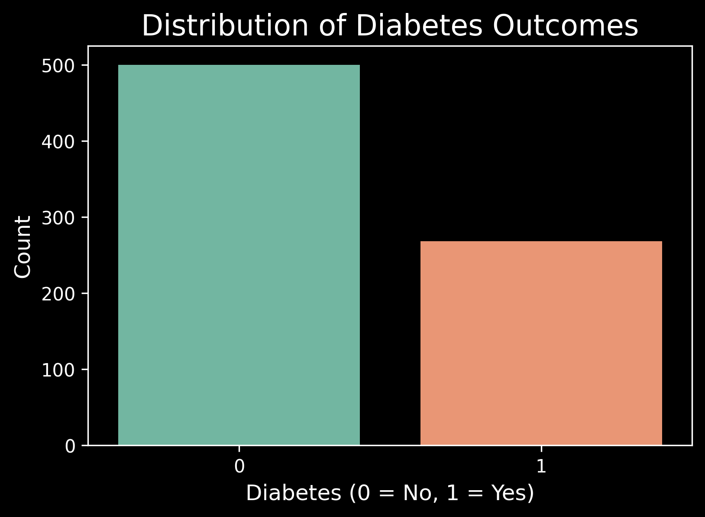
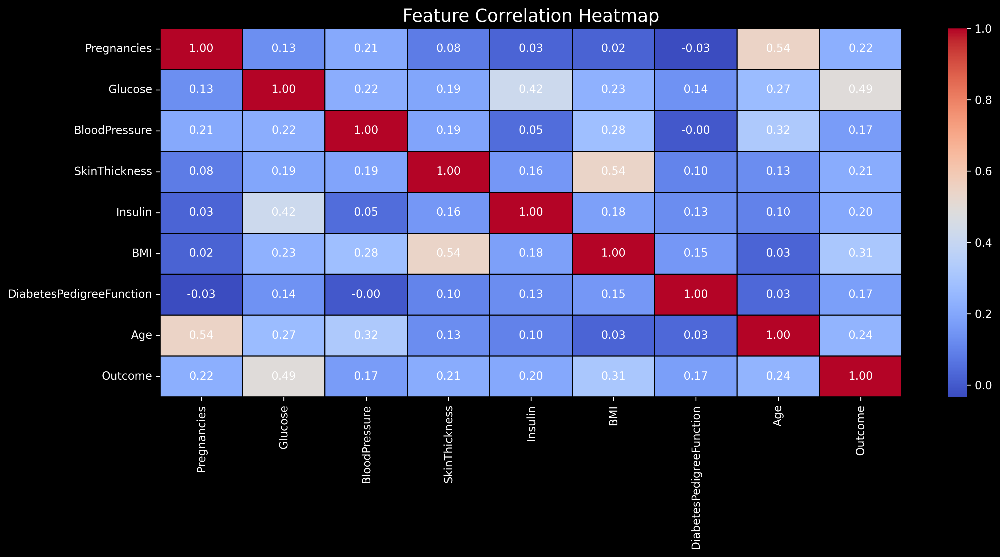

## Diabetes Prediction

A machine learning project to predict diabetes using the **Pima Indians Diabetes Dataset**. This project explores multiple classification models and data visualization techniques to understand the relationship between features and diabetes outcomes.

###  Dataset

[Kaggle - Pima Indians Diabetes Database](https://www.kaggle.com/datasets/uciml/pima-indians-diabetes-database)

---

## Project Highlights

* Cleaned and preprocessed the dataset by handling missing and zero values.
* Visualized feature distributions and correlations using dark-themed Seaborn plots.
* Trained and compared multiple models:
  * Support Vector Machine (SVM)
  * Logistic Regression
  * Decision Tree
  * Random Forest
* Built an input interface for predicting diabetes on new data.

---

## Project Structure

```
diabetes-prediction/
│
├── diabetes_prediction.ipynb       # Main notebook (EDA, model training, results)
├── diabetes_prediction.py          # Script version of the notebook
├── data/
│   └── diabetes.csv                # Dataset
├── images/
│   ├── diabetes_countplot.png      # Countplot of diabetes outcome
│   ├── diabetes_heatmap.png        # Feature correlation heatmap
│   └── diabetes_pairplot.png       # Pairplot of selected features
├── requirements.txt                # List of dependencies
└── README.md                       # Project overview
```

---

## Dependencies

* Python 3.7+
* pandas
* numpy
* scikit-learn
* matplotlib
* seaborn

Install dependencies via pip:

```bash
pip install pandas numpy scikit-learn matplotlib seaborn
```
or:
```bash
pip install -r requirements.txt
```

---

## Example Outputs

### 🔹 Countplot



### 🔹 Heatmap



### 🔹 Pairplot


---

## 🤖 Model Accuracy Comparison

| Model               | Accuracy |
| ------------------- | -------- |
| SVM (Linear Kernel) | \~0.7727   |
| Logistic Regression | \~0.7403   |
| Decision Tree       | \~0.6688   |
| Random Forest       | \~0.7532   |


---

## Predict on New Input

The script allows predictions on custom input like:

```python
input_data = (1, 189, 40, 27, 846, 30.1, 0.398, 59)
```
---
## Author

**Moustafa Mohamed**
 [LinkedIn](https://www.linkedin.com/in/moustafa-mohamed-047736296/)
| [GitHub](https://github.com/MoustafaMohamed01)
| [Kaggle](https://www.kaggle.com/moustafamohamed01)
