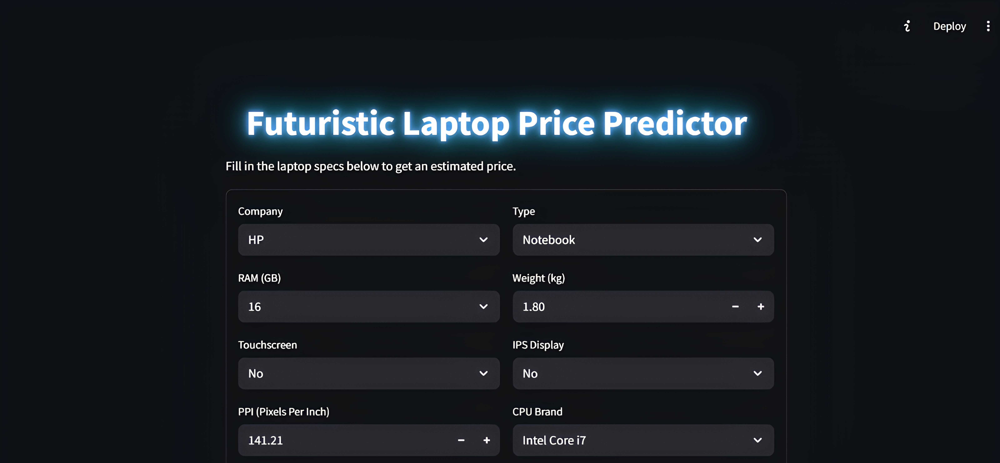

# Laptop Price Prediction

## Project Overview

This project aims to build a machine learning model to predict laptop prices based on various specifications and features. It involves comprehensive data cleaning, exploratory data analysis (EDA), feature engineering, model training, and evaluation using multiple regression algorithms. The project also includes visualization of data distributions and relationships to better understand the factors affecting laptop prices.

---

## Project Structure

```

laptop-price-prediction/
│
├── data/
│   ├── laptop_data.csv                # Raw laptop dataset
│   └── cleaned_laptop_data.csv       # Cleaned and preprocessed dataset
│
├── distributions/                    # Folder containing all visualization images
│
├── python/
│   ├── data_cleaning_and_eda.py      # Data cleaning, feature engineering, and EDA script
│   ├── train_model.py                 # Model training, comparison, and saving best model
│   └── predict.py                    # Script for making price predictions using the trained model
│
├── models/
│   └── best_laptop_price_model.pkl   # Serialized best performing regression model
│
├── streamlit_app/
│   ├── app.py                        # Streamlit app for interactive laptop price prediction
│   └── screenshot.jpg               # Screenshot image(s) of the Streamlit app interface
│
├── requirements.txt                  # Python dependencies
└── README.md                        # Project documentation

````

---

## Dataset

- The original raw dataset (`laptop_data.csv`) contains detailed laptop specifications including brand, type, RAM, storage, CPU, GPU, screen resolution, and price among other features.
- The cleaned dataset (`cleaned_laptop_data.csv`) is the result of preprocessing steps such as:
  - Removing duplicates and irrelevant columns.
  - Converting units (e.g., RAM and weight).
  - Feature extraction from composite fields (e.g., screen resolution into PPI).
  - Encoding categorical variables.
  - Handling missing or inconsistent data.
  
---

## Key Features and Data Processing

- **Features include:**
  - Company, TypeName, Ram, Weight, TouchScreen, IPS, CpuBrand, SSD, HDD, GpuBrand, Operating System (cleaned).
- **Feature engineering:**
  - Extracted TouchScreen and IPS from screen resolution.
  - Calculated Pixels Per Inch (PPI) from screen resolution and screen size.
  - Converted storage capacities (SSD, HDD) into unified GB units.
  - Encoded categorical variables using OneHotEncoder.
- **Data Visualization:**
  - Distribution plots for price, RAM, weight, and screen size.
  - Bar plots for average price by company, CPU brand, GPU brand, and OS.
  - Correlation heatmap and scatter plots to understand relationships.

---

## Model Training and Evaluation

- Multiple regression models were trained and compared, including:
  - Linear Regression, Ridge, Lasso
  - Decision Tree, Random Forest, Extra Trees
  - Gradient Boosting, AdaBoost, XGBoost
  - Support Vector Regression, K-Nearest Neighbors
- Evaluation metrics:
  - R² Score
  - Mean Absolute Error (MAE)
  - Root Mean Squared Error (RMSE)
- The best-performing model is saved as `best_laptop_price_model.pkl` for inference.

---

## How to Use

### 1. Setup Environment

```bash
pip install -r requirements.txt
````

### 2. Run Data Cleaning and EDA

```bash
python python/data_cleaning_and_eda.py
```

This script processes raw data, performs EDA, saves plots to the `distributions/` folder, and outputs the cleaned dataset.

### 3. Train Model

```bash
python python/train_model.py
```

This script loads the cleaned data, trains multiple models, evaluates their performance, and saves the best model.

### 4. Make Predictions (CLI)

```bash
python python/predict.py
```

Use this script to load the trained model and predict laptop prices given input features.

### 5. Run Streamlit App

```bash
streamlit run app.py
```

This launches the interactive web app where you can enter laptop specs and get instant price predictions with a user-friendly interface.

---

## Screenshots


*Screenshot of the laptop price prediction Streamlit app interface.*

---

## Dependencies

Key Python libraries used in this project:

* numpy
* pandas
* seaborn
* matplotlib
* scikit-learn
* xgboost
* joblib
* streamlit

Please see `requirements.txt` for the full list.

---

## Results and Visualizations

The `distributions/` folder contains detailed plots showcasing data distributions and relationships, such as:

* Price distribution and log-transformed price distribution
* Count and average price by Company, CPU Brand, GPU Brand, and Operating System
* Scatter plots of price vs screen size and weight
* Correlation heatmaps

---

## Author

Created by **Moustafa Mohamed** - feel free to reach out!

* GitHub: [MoustafaMohamed01](https://github.com/MoustafaMohamed01)
* Linkedin: [Moustafa Mohamed](https://www.linkedin.com/in/moustafamohamed01/)
* Kaggle: [moustafamohamed01](https://www.kaggle.com/moustafamohamed01)

---
