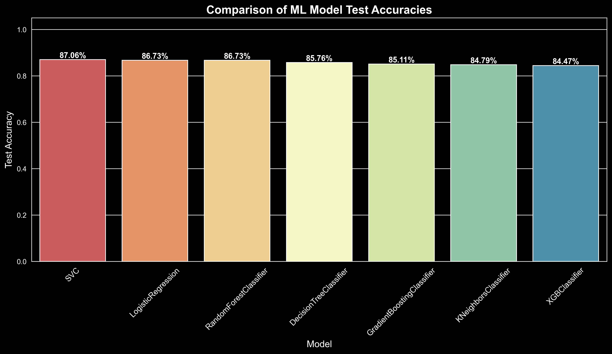

# Stock Market Movement Classification using Machine Learning

This project implements and compares multiple machine learning models to predict the **next-day price movement** (up/down) of a stock based on technical features derived from Open, Close, High, and Low prices.

It includes data preprocessing, feature engineering, model training with hyperparameter tuning using `GridSearchCV`, visualization of model performance, and saving the best-performing model.

---

## Overview

- **Goal:** Classify whether the stock will go **up (1)** or **down (0)** the next day.
- **Approach:** Supervised learning using:
  - Logistic Regression
  - K-Nearest Neighbors (KNN)
  - Decision Tree
  - Random Forest
  - Gradient Boosting
  - Support Vector Machine (SVC)
  - XGBoost

---

## Tech Stack

- Python
- NumPy, Pandas
- Scikit-learn
- XGBoost
- Seaborn & Matplotlib
- Joblib (for model saving)

---

## Project Structure

```
ML-Projects/
stock-price-prediction
   ├── data/
   │   └── NSE-TATAGLOBAL11.csv
   ├── images/
   │   └── comparison-of-ml-models-acc.png
   ├── best_stock_prediction_model.pkl
   ├── stock-price-prediction.ipynb
   ├── stock-price-prediction.py
   └── README.md

````

---

## How to Run

1. **Clone this repository:**
   ```bash
   git clone https://github.com/MoustafaMohamed01/ML-Projects.git
   cd ML-Projects/stock-price-prediction
   ````

2. **Install dependencies:**

   ```bash
   pip install -r requirements.txt
   ```

3. **Run the notebook:**

   * Open `stock_model_comparison.ipynb` in Jupyter Notebook or VS Code and execute all cells.

---

## Sample Output

| Model                      | Train Accuracy | Test Accuracy |
| -------------------------- | -------------- | ------------- |
| **SVC**                    | 0.8768         | **0.8706**    |
| LogisticRegression         | 0.8670         | 0.8673        |
| RandomForestClassifier     | 0.8908         | 0.8673        |
| DecisionTreeClassifier     | 0.8768         | 0.8576        |
| GradientBoostingClassifier | 0.8897         | 0.8511        |
| KNeighborsClassifier       | 0.8832         | 0.8479        |
| XGBClassifier              | 0.9200         | 0.8447        |

Best model: **SVC**
Saved as: `best_stock_prediction_model.pkl`

---

## Visualizations



---


---

## Contact

**Moustafa Mohamed**
[LinkedIn](https://www.linkedin.com/in/moustafamohamed01/) | [GitHub](https://github.com/MoustafaMohamed01) | [Kaggle](https://www.kaggle.com/moustafamohamed01) | [Portfolio](https://moustafamohamed.netlify.app/)

---
